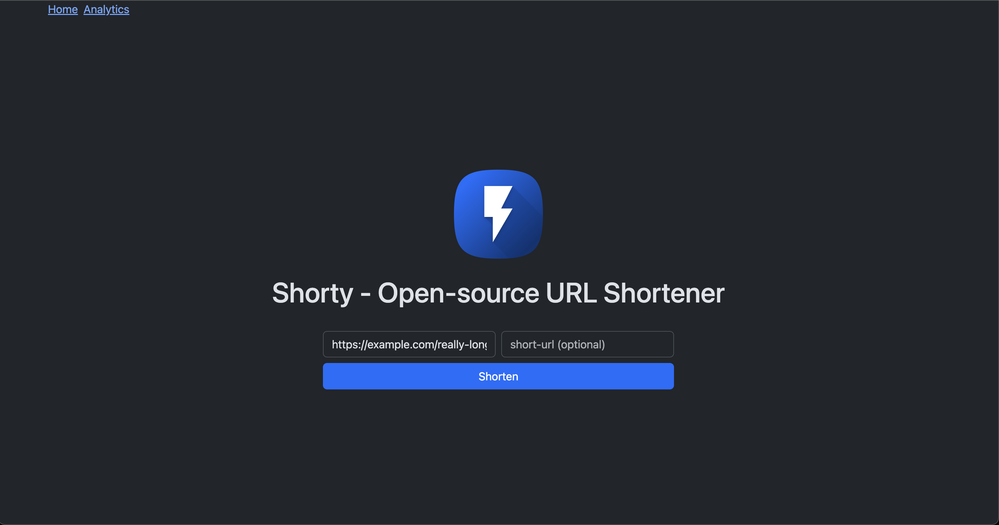
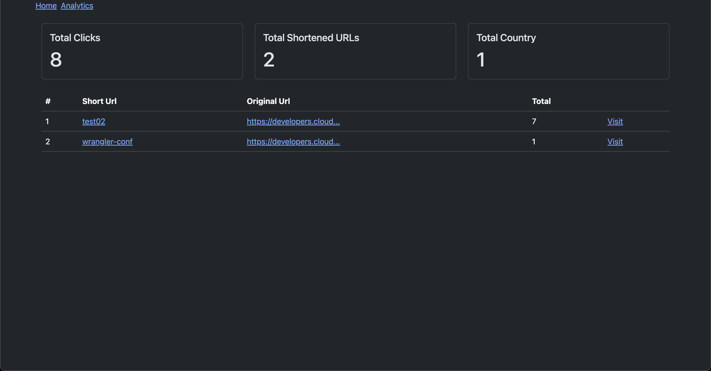
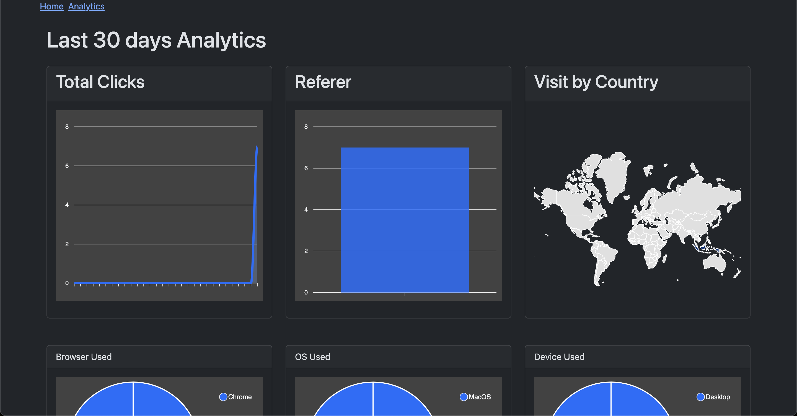

# Shortly

A simple and efficient URL shortener with analytics deployable on Cloudflare Worker, powered by Hono, Cloudflare KV, and Cloudflare D1.

## Features

- Shorten long URLs into concise, easy-to-share links.
- Track click analytics.
- Fast and scalable using Cloudflare Workers and KV.

## Example Usage





## Tech Stack

- **Backend:** Hono (running on Cloudflare Workers)
- **Storage:** Cloudflare KV, Cloudflare D1
- **Frontend:** Server-rendered JSX

## Deployment

### GitHub Actions

1. Clone the repository
2. Create a Cloudflare account
3. Create a Cloudflare Workers KV namespace. Keep the ID.
4. Create a Cloudflare Workers D1 database. Keep the ID.
5. Generate a Cloudflare API token. Make sure to allow the `Worker`, `KV` and `D1` scopes.
6. Copy `wrangler.example.jsonc` and update the values. Encode it with base64. Keep the encoded value.
7. Create a GitHub actions secret
   - CLOUDFLARE_API_TOKEN
   - CLOUDFLARE_ACCOUNT_ID
   - ADMIN_USERNAME
   - ADMIN_PASSWORD
   - CLOUDFLARE_WRANGLER_CONFIG
8. Will automatically deploy to Cloudflare Workers every time tag is created.

### Manual Deployment

1. Clone the repository
2. Create a Cloudflare account
3. Create a Cloudflare Workers KV namespace. Keep the ID.
4. Create a Cloudflare Workers D1 database. Keep the ID.
5. Copy `wrangler.example.jsonc` to `wrangler.jsonc` and update the values.
6. Migrate the database
   ```sh
   pnpm run db:migrate --remote
   ```
7. Deploy
   ```sh
   pnpm run deploy
   ```

## Local Development

1. Clone the repository:
   ```sh
   git clone https://github.com/razrinn/shortly.git
   cd shortly
   ```
2. Install dependencies:
   ```sh
   pnpm install
   ```
3. Set up environment variables:
   - Copy `.dev.example.vars` to `.dev.vars` and update the values.
   - copy `wrangler.example.jsonc` to `wrangler.jsonc` and update the values.
4. Create Local Database

   - D1 Local Database
     ```sh
     pnpm dlx wrangler d1 create shortly-url
     ```
   - KV Local Database
     ```sh
     pnpm dlx wrangler kv namespace create KV_STORE
     ```

5. Migrate Local Database

   ```sh
   pnpm run db:migrate
   ```

6. Run locally:

   ```sh
   pnpm run dev
   ```

7. Open [`http://localhost:8787`](http://localhost:8787) to view it in the browser.

## Contributing

1. Fork the repo
2. Create a new branch
3. Commit your changes
4. Push to the branch
5. Create a pull request

## License

MIT License

Copyright (c) 2025 [Ray Azrin Karim]

Permission is hereby granted, free of charge, to any person obtaining a copy
of this software and associated documentation files (the "Software"), to deal
in the Software without restriction, including without limitation the rights
to use, copy, modify, merge, publish, distribute, sublicense, and/or sell
copies of the Software, and to permit persons to whom the Software is
furnished to do so, subject to the following conditions:

The above copyright notice and this permission notice shall be included in all
copies or substantial portions of the Software.

THE SOFTWARE IS PROVIDED "AS IS", WITHOUT WARRANTY OF ANY KIND, EXPRESS OR
IMPLIED, INCLUDING BUT NOT LIMITED TO THE WARRANTIES OF MERCHANTABILITY,
FITNESS FOR A PARTICULAR PURPOSE AND NONINFRINGEMENT. IN NO EVENT SHALL THE
AUTHORS OR COPYRIGHT HOLDERS BE LIABLE FOR ANY CLAIM, DAMAGES OR OTHER
LIABILITY, WHETHER IN AN ACTION OF CONTRACT, TORT OR OTHERWISE, ARISING FROM,
OUT OF OR IN CONNECTION WITH THE SOFTWARE OR THE USE OR OTHER DEALINGS IN THE
SOFTWARE.
